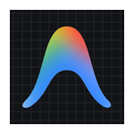

  <!-- ==================== HERO HEADER ==================== -->
  

  <!-- Animación de Typing Dinámica -->
  

    

  <!-- Presentación Natural y Humana -->
  

    ¡Hola! Soy <b>Álvaro</b>, desarrollador apasionado por crear aplicaciones web dinámicas y arquitecturas de datos sólidas. 
    Me enfoco en el rendimiento, la estética moderna y el código limpio y mantenible.
  

   

  <!-- Enlaces Rápidos -->
  
  &nbsp;
  

 

---

### 💻 Lenguajes de Programación

  <table border="0">
    <tr align="center">
      <td width="74"> <b>HTML5</b></td>
      <td width="74"> <b>CSS3</b></td>
      <td width="74"> <b>JavaScript</b></td>
      <td width="74"> <b>Python</b></td>
      <td width="74"> <b>PHP</b></td>
      <td width="74"> <b>JSON</b></td>
    </tr>
  </table>

---

### ⚡ Frameworks & Librerías

  <table border="0">
    <tr align="center">
      <td width="80"> <b>React</b></td>
      <td width="80"> <b>Discord.py</b></td>
      <td width="80"> <b>Discord.js</b></td>
    </tr>
  </table>

---

### 🛠️ Editores & IDEs

  <table border="0">
    <tr align="center">
      <td width="80"> <b>VS Code</b></td>
      <td width="80"> <b>Antigravity</b></td>
      <td width="80"> <b>PyCharm</b></td>
      <td width="80"> <b>IntelliJ</b></td>
    </tr>
  </table>

---

### 🖥️ Sistemas Operativos

  <table border="0">
    <tr align="center">
      <td width="75"> <b>Linux</b></td>
      <td width="75"> <b>Debian</b></td>
      <td width="75"> <b>Ubuntu</b></td>
      <td width="75"> <b>Android</b></td>
      <td width="75"> <b>Windows</b></td>
    </tr>
  </table>

---

### 🌐 Otras Tecnologías & Herramientas

  <table border="0">
    <tr align="center">
      <td width="72"> <b>Chrome</b></td>
      <td width="72"> <b>Firefox</b></td>
      <td width="72"> <b>Tor</b></td>
      <td width="72"> <b>Opera GX</b></td>
      <td width="72"> <b>Node.js</b></td>
      <td width="72"> <b>Docker</b></td>
      <td width="72"> <b>VirtualBox</b></td>
    </tr>
    <tr align="center">
      <td width="72"> <b>MySQL</b></td>
      <td width="72"> <b>SQLite</b></td>
      <td width="72"> <b>MariaDB</b></td>
      <td width="72"> <b>PostgreSQL</b></td>
      <td width="72"> <b>Git</b></td>
      <td width="72"> <b>GitHub</b></td>
      <td width="72"> <b>WordPress</b></td>
    </tr>
  </table>

 

---

### 🕹️ Historial de Contribuciones

  <picture>
    <source media="(prefers-color-scheme: dark)" srcset="https://raw.githubusercontent.com/Zak208/Zak208/output/github-contribution-grid-snake-dark.svg">
    <source media="(prefers-color-scheme: light)" srcset="https://raw.githubusercontent.com/Zak208/Zak208/output/github-contribution-grid-snake.svg">
    
  </picture>

